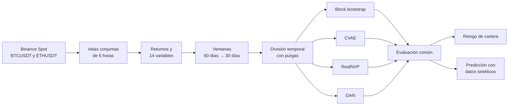
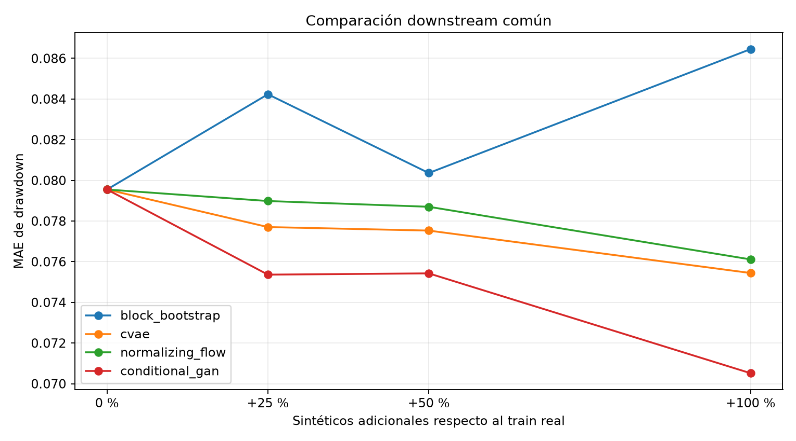

# Generación de trayectorias financieras sintéticas BTC–ETH

Este proyecto compara cuatro métodos para generar escenarios conjuntos de
Bitcoin y Ethereum: *block bootstrap*, CVAE, Normalizing Flow y GAN. El objetivo
es estudiar si reproducen el comportamiento del mercado y si sus datos
sintéticos resultan útiles para medir y predecir riesgo.

## Estructura del repositorio

```text
Taller_Generativos/
├── data/                         datos y divisiones temporales
├── notebooks/                    experimentos ejecutados
├── outputs/downstream_common/    resultados ligeros versionados
├── scripts/                      preparación, entrenamiento y evaluación
├── src/crypto_generative/        implementación del proyecto
├── tests/                        pruebas automáticas
├── pyproject.toml                dependencias directas
└── uv.lock                       entorno reproducible
```

## Notebooks

Los ocho notebooks están ejecutados y conservan sus tablas y figuras.

| Notebook | Contenido |
|---|---|
| [`01_block_bootstrap_multivariante.ipynb`](notebooks/01_block_bootstrap_multivariante.ipynb) | Modelo estadístico de referencia |
| [`CVAE_BTC_ETH.ipynb`](notebooks/CVAE_BTC_ETH.ipynb) | Arquitectura, entrenamiento y evaluación del CVAE |
| [`Normalizing_Flow_BTC_ETH.ipynb`](notebooks/Normalizing_Flow_BTC_ETH.ipynb) | Entrenamiento y evaluación del RealNVP |
| [`GAN_BTC_ETH.ipynb`](notebooks/GAN_BTC_ETH.ipynb) | Ajuste, entrenamiento y evaluación de la GAN |
| [`02_aplicacion_cartera_y_stress.ipynb`](notebooks/02_aplicacion_cartera_y_stress.ipynb) | Cartera común y escenarios de estrés |
| [`03_generacion_masiva_ultimo_estado.ipynb`](notebooks/03_generacion_masiva_ultimo_estado.ipynb) | 100.000 escenarios por modelo para la última condición |
| [`05_comparacion_downstream_comun.ipynb`](notebooks/05_comparacion_downstream_comun.ipynb) | Comparación de datos reales y sintéticos en predicción |
| [`04_comparacion_final_consolidada.ipynb`](notebooks/04_comparacion_final_consolidada.ipynb) | Comparación final de fidelidad, riesgo y utilidad |

## Resumen

Cada modelo recibe 60 días de contexto y genera trayectorias de retornos para
los 30 días siguientes. Todos trabajan con los mismos datos, la misma división
temporal y el mismo sistema de evaluación.

Los escenarios se aplican a una cartera 60 % BTC / 40 % ETH para calcular VaR,
Expected Shortfall y máximo *drawdown*. También se utilizan para ampliar el
entrenamiento de una MLP que predice el *drawdown* de la cartera.

Los resultados muestran que ningún método domina en todo:

- el **block bootstrap** reproduce mejor los marginales y la dependencia en
  situaciones de estrés, además de ofrecer la estimación de riesgo más
  conservadora;
- el **CVAE** ofrece el mejor equilibrio y es el único cuyos datos sintéticos
  mejoran la predicción después de seleccionar la mezcla con validación;
- el **Normalizing Flow** reproduce mejor varias propiedades temporales;
- la **GAN** genera variedad, pero sus trayectorias se distinguen con facilidad
  de las reales.

Por tanto, imitar bien el mercado y mejorar una tarea de predicción son dos
objetivos relacionados, pero no equivalentes.

## Objetivo del estudio

La pregunta principal es si los modelos generativos no lineales aportan mejoras
medibles frente a un método estadístico sencillo. Se estudian tres aspectos por
separado:

1. **Fidelidad:** cuánto se parecen las trayectorias sintéticas a las reales.
2. **Riesgo:** cómo representan las pérdidas y los eventos extremos.
3. **Utilidad:** si ayudan a entrenar un modelo de predicción con datos reales.

No se combinan en una única puntuación porque cada aspecto responde a una
pregunta diferente.

## Diseño del experimento



### Datos

| Propiedad | Valor |
|---|---|
| Fuente | Binance Spot: `BTCUSDT` y `ETHUSDT` |
| Periodo | 17/08/2017–31/07/2026 |
| Frecuencia | 6 horas, UTC |
| Contexto / horizonte | 60 días / 30 días |
| Variables de contexto | 14 |
| Muestras válidas | 9.096 |
| Entrenamiento / validación / prueba | 4.710 / 1.832 / 1.826 |
| Muestras eliminadas por las purgas | 728 |

La división es temporal y los datos de validación y prueba no intervienen en la
normalización. Las ventanas se solapan, por lo que las 9.096 muestras no
equivalen a 9.096 episodios económicos independientes.

La fuente trabaja con pares contra USDT. En la aplicación se utiliza como
aproximación operativa al dólar, sin presentarlo como USD fiat. La procedencia y
preparación de los datos se explican en [`data/README.md`](data/README.md).

### Modelos

| Método | Funcionamiento |
|---|---|
| **Block bootstrap condicionado** | Remuestrea bloques conjuntos BTC–ETH de 12 pasos entre los 128 estados de mercado más cercanos. |
| **CVAE Student-t** | Genera ambos activos de forma conjunta y permite representar colas gruesas. La configuración se elige entre 39 candidatos. |
| **Conditional RealNVP** | Utiliza ocho capas de acoplamiento y se selecciona por la NLL de validación. |
| **Conditional GAN** | Enfrenta un generador y un discriminador condicionados. Se comparan tres configuraciones. |

Los cuatro métodos generan escenarios condicionados por las mismas 14 variables
del estado anterior del mercado, aunque utilizan mecanismos diferentes.

### Evaluación

`TrajectoryEvaluator` compara distribución, dinámica temporal, relación
BTC–ETH, forma de las trayectorias, riesgo y diversidad. Cada modelo genera 20
escenarios para cada una de las 1.826 condiciones de prueba. También se
comprueban 16 condiciones separadas entre sí para controlar el efecto del
solapamiento.

## Resultados

### Fidelidad de las trayectorias

Un valor menor indica mayor similitud con los datos reales de prueba.

| Dimensión | Mejor método | Valor |
|---|---|---:|
| Fidelidad marginal | Block bootstrap | 0,1063 |
| Persistencia de volatilidad | Normalizing Flow | 0,0491 |
| Correlación BTC–ETH en estrés | Block bootstrap | 0,0384 |
| Dependencia de cola inferior | Block bootstrap | 0,0394 |
| Distribución del retorno final | Normalizing Flow | 0,3332 |
| Máximo *drawdown* | Normalizing Flow | 0,1616 |
| Error de cobertura VaR 95 % | Normalizing Flow | 0,1263 |
| Error de cobertura VaR 99 % | Normalizing Flow | 0,1242 |
| Cobertura de regímenes | CVAE | 0,1395 |

El bootstrap condicionado destaca en marginales y dependencia BTC–ETH. El CVAE
es el modelo neuronal más equilibrado y el más difícil de distinguir de los
datos reales, aunque su discriminador todavía alcanza 0,7445 frente al 0,5
ideal. El Flow lidera varias propiedades temporales, pero su discriminador llega
a 0,9781 y la validación muestra sobreajuste desde la época 5. La GAN obtiene
1,0, lo que indica que su variedad no se traduce en realismo.

### Utilidad de los datos sintéticos

La tarea consiste en predecir el máximo *drawdown* a 30 días de una cartera
60/40 mediante una MLP `14 → 64 → 32 → 1`. La red no cambia; solo varía la
cantidad de datos sintéticos añadidos al entrenamiento: 0 %, 25 %, 50 % o
100 % respecto a las 4.710 muestras reales.

La mezcla se elige por el MAE de validación. Validación y prueba contienen
siempre datos 100 % reales.

| Generador | Mezcla elegida | MAE en prueba |
|---|---:|---:|
| Block bootstrap | +25 % | 8,468 % |
| CVAE | **+25 %** | **7,770 %** |
| Normalizing Flow | Solo datos reales | 7,955 % |
| Conditional GAN | Solo datos reales | 7,955 % |

La mezcla del bootstrap mejora en validación, pero empeora el MAE de prueba
frente al 7,955 % obtenido solo con datos reales. En cambio, el CVAE reduce el
MAE un **2,32 %** y es el único cuya mejora se mantiene después de la selección.
Todos los R² de prueba son negativos, por lo que la MLP todavía no constituye
un predictor satisfactorio.



### Riesgo de la cartera

La cartera parte de 100.000 unidades monetarias, con 60 % BTC y 40 % ETH, sin
rebalanceo, apalancamiento ni costes.

| Fuente de escenarios | VaR 99 % | ES 99 % |
|---|---:|---:|
| Histórico de prueba | 32,48 % | 33,52 % |
| Block bootstrap | 46,42 % | 52,42 % |
| CVAE | 28,32 % | 33,69 % |
| Normalizing Flow | 30,14 % | 35,37 % |
| Conditional GAN | 35,89 % | 42,79 % |

El bootstrap es la estimación más conservadora. El ES 99 % del CVAE queda cerca
del histórico, pero eso no garantiza que estime bien cada estado del mercado:
su VaR 95 % presenta alrededor de un 20–22 % de excepciones frente al 5 %
esperado. Con solo 20 escenarios por condición, las métricas condicionales al
99 % deben interpretarse como exploratorias.

## Limitaciones

- Las ventanas se solapan y no representan episodios independientes.
- El bootstrap remuestrea bloques históricos cercanos, mientras que los modelos
  neuronales aprenden distribuciones paramétricas.
- Veinte escenarios por condición son insuficientes para estimar con precisión
  VaR y ES al 99 %.
- Ninguna configuración de predicción alcanza un R² positivo.
- No se consideran derivados, apalancamiento, costes, liquidez, contraparte ni
  regulación.

Los resultados son experimentales y no constituyen un sistema de inversión ni
un modelo de capital regulatorio.

Los modelos guardados y los escenarios de gran tamaño se generan en `outputs/`
y no se versionan.

## Documentación adicional

- [`data/README.md`](data/README.md): procedencia y reconstrucción de los datos.
- [`cripto-generativa-contexto-y-reparto.md`](cripto-generativa-contexto-y-reparto.md):
  alcance y decisiones iniciales del proyecto.
